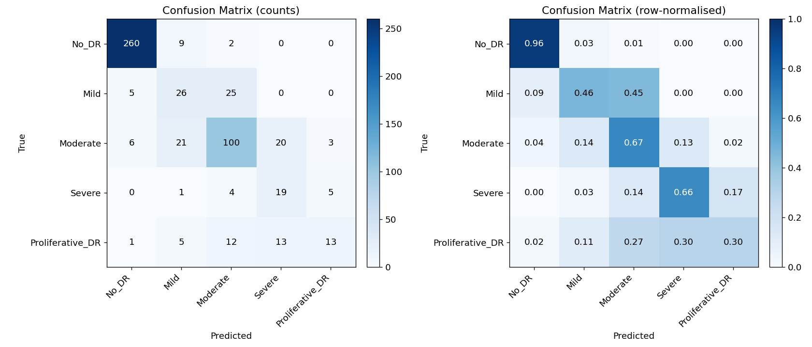
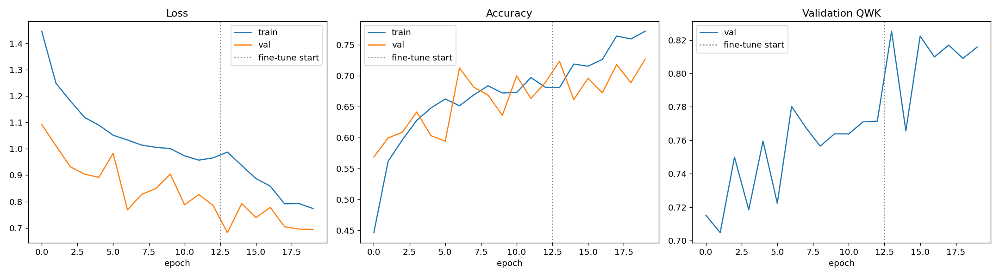
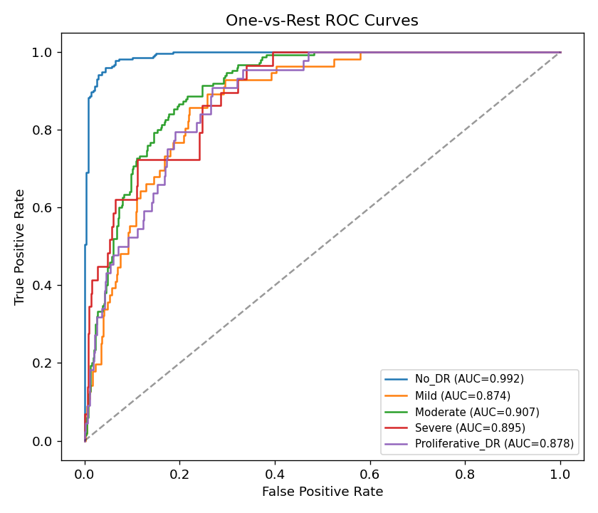
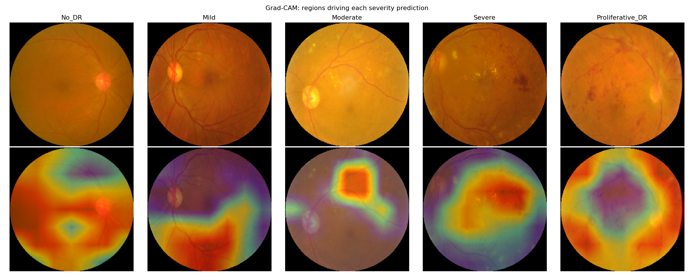

<!-- RESULTS_AUTOFILLED: numbers in this file are produced by src/evaluate.py -->
# Diabetic Retinopathy Severity Grading — APTOS 2019

Transfer-learning pipeline that grades diabetic retinopathy (DR) severity from retinal **fundus
photographs** into the five clinical classes used by the
[APTOS 2019 Blindness Detection](https://www.kaggle.com/competitions/aptos2019-blindness-detection)
competition. Built with TensorFlow/Keras and EfficientNetB0, with class-imbalance handling,
**Quadratic Weighted Kappa** (the competition metric) reporting, and **Grad-CAM** explanations.


> ⚠️ **Disclaimer.** This is a research/education project, **not a medical device**. It must not be
> used for clinical diagnosis or treatment decisions.

---

## Table of contents
- [What it does](#what-it-does)
- [Results](#results)
- [Why Quadratic Weighted Kappa?](#why-quadratic-weighted-kappa)
- [Dataset](#dataset)
- [Method](#method)
- [How to run](#how-to-run)
- [Project structure](#project-structure)
- [Reproducibility & limitations](#reproducibility--limitations)

---

## What it does

Given a retinal fundus image, the model predicts one of five ordinal severity grades:

| Grade | Class | Clinical meaning |
|:-----:|:------|:-----------------|
| 0 | `No_DR` | No diabetic retinopathy |
| 1 | `Mild` | Microaneurysms only |
| 2 | `Moderate` | More extensive microaneurysms / haemorrhages |
| 3 | `Severe` | Extensive haemorrhages, venous beading, IRMA |
| 4 | `Proliferative_DR` | Neovascularisation / vitreous haemorrhage |

The pipeline covers the full workflow: automatic dataset download, fundus-specific preprocessing,
augmented `tf.data` input, two-phase EfficientNetB0 transfer learning, imbalance-aware training, a
complete evaluation suite, and Grad-CAM visual explanations.

---

## Results

Evaluated on a **held-out test set of `550` images** (15% of the data, stratified, never
seen during training or model selection). Trained on an Apple M-series GPU via `tensorflow-metal`.

| Metric | Score |
|:-------|:-----:|
| **Quadratic Weighted Kappa** | **`0.851`** |
| Accuracy | `0.760` |
| Macro ROC-AUC (one-vs-rest) | `0.909` |

**Per-class performance**

| Class | Precision | Recall | F1 | Support |
|:------|:---------:|:------:|:--:|:-------:|
| No_DR | `0.96` | `0.96` | `0.96` | `271` |
| Mild | `0.42` | `0.46` | `0.44` | `56` |
| Moderate | `0.70` | `0.67` | `0.68` | `150` |
| Severe | `0.37` | `0.66` | `0.47` | `29` |
| Proliferative_DR | `0.62` | `0.30` | `0.40` | `44` |

For context, the APTOS 2019 competition was won at ~0.93 QWK; scores in the **0.85–0.90** range are
strong for a single EfficientNetB0 without ensembling or test-time augmentation.

**Confusion matrix**



Most errors fall on the diagonal's immediate neighbours (e.g. Mild↔Moderate) rather than across the
severity scale — exactly the behaviour QWK rewards.

**Training history**



The dotted line marks the switch from frozen-head training to fine-tuning.

**ROC curves (one-vs-rest)**



**Grad-CAM — what the model looks at**



Top row: preprocessed fundus images (one confident example per grade). Bottom row: Grad-CAM overlays.
Activation concentrates on the retina and lesion-bearing regions rather than the background or optic
disc alone, which is the qualitative sanity check we want from a DR grader.

---

## Why Quadratic Weighted Kappa?

DR severity is **ordinal** — the grades lie on a scale, and not all mistakes are equal:

- Predicting **Severe (3)** for a **Proliferative (4)** case is a small, one-step error.
- Predicting **No_DR (0)** for a **Proliferative (4)** case is a catastrophic five-step error that
  could send a patient who needs urgent treatment home untreated.

**Plain accuracy treats both mistakes identically.** Quadratic Weighted Kappa (QWK) does not: it
weights each disagreement by the **squared distance** between predicted and true grade, and corrects
for the agreement expected by chance. A model that stays *close* on the severity scale scores well;
one that makes large jumps is punished heavily. QWK is the **official APTOS 2019 metric**, so it is
the number we optimise for (via a custom Keras callback) and report first — accuracy and per-class
metrics are included for a fuller picture.

---

## Dataset

- **APTOS 2019 Blindness Detection** — 3,662 labelled fundus images captured with varied cameras and
  conditions across multiple clinics in India.
- **Heavily imbalanced:** ~49% `No_DR`, ~27% `Moderate`, and only ~5% `Severe`.

| Grade | No_DR | Mild | Moderate | Severe | Proliferative_DR |
|:------|:-----:|:----:|:--------:|:------:|:----------------:|
| Count | 1805 | 370 | 999 | 193 | 295 |

**Download.** The code uses **`kagglehub`** as the primary source (the canonical Kaggle competition
data — requires a free Kaggle API key). If no Kaggle credentials are available, it **automatically
falls back to a public Hugging Face mirror** of the same files, so training runs with zero manual
setup. Both paths yield an identical `train.csv` + `train_images/` layout.

---

## Method

**Preprocessing** (`src/preprocessing.py`)
- Crop the black border to the retinal disc's bounding box.
- Resize to 224×224 and apply a circular mask to remove bright corner artefacts.
- No manual intensity normalisation — EfficientNet normalises internally and expects `[0, 255]`
  inputs. Deliberately gentle so microaneurysms/haemorrhages/exudates stay visible for Grad-CAM.
- Every image is preprocessed once into a resized cache for fast, repeatable training.

**Augmentation** (fundus-safe)
- Random horizontal/vertical flips and rotations (label-preserving — retinas have no canonical
  orientation), plus mild brightness/contrast jitter.
- **No** shear or elastic warping, which would distort the morphology of diagnostic lesions.

**Imbalance handling**
- Inverse-frequency **class weights** by default (weighted cross-entropy); **focal loss** is also
  implemented (`--imbalance focal`).
- Model selection on **validation QWK**, not accuracy, so the majority class can't dominate.

**Model & training** (`src/model.py`, `src/train.py`)
- **EfficientNetB0** pretrained on ImageNet, built as a flat graph so every conv layer stays
  addressable (needed for fine-tuning and Grad-CAM), plus a `GAP → Dropout → Dense(5, softmax)` head.
- **Phase 1:** freeze the backbone, train the head (Adam, lr 1e-3).
- **Phase 2:** unfreeze the top ~40 layers and fine-tune (Adam, lr 1e-4) with **BatchNorm kept
  frozen** to preserve ImageNet statistics.
- Early stopping + `ReduceLROnPlateau` + best-QWK checkpointing throughout.

**Evaluation** (`src/evaluate.py`) — accuracy, per-class precision/recall/F1, confusion matrix
(counts + normalised), one-vs-rest ROC-AUC, QWK, training curves, and Grad-CAM grids.

---

## How to run

### Option A — Colab notebook (easiest)
Open [`notebooks/diabetic_retinopathy_aptos.ipynb`](notebooks/diabetic_retinopathy_aptos.ipynb) in
Google Colab, set **Runtime → GPU**, and **Run all**. The only optional manual step is uploading your
`kaggle.json` when prompted; skip it and the notebook uses the Hugging Face mirror automatically.

### Option B — local CLI
```bash
# 1. Environment
python -m venv .venv && source .venv/bin/activate
pip install -r requirements.txt
# Apple Silicon only, for GPU acceleration:
#   pip install tensorflow-metal

# 2. (Optional) Kaggle credentials for the canonical source
mkdir -p ~/.kaggle && cp /path/to/kaggle.json ~/.kaggle/ && chmod 600 ~/.kaggle/kaggle.json
# Without this, the pipeline uses the public Hugging Face mirror.

# 3. Train (downloads + preprocesses data on first run)
python -m src.train                     # defaults
python -m src.train --imbalance focal   # try focal loss
python -m src.train --finetune-unfreeze 60

# 4. Evaluate the held-out test set → metrics + figures
python -m src.evaluate
```
Artifacts land in `outputs/` (model, `metrics.json`, `history.json`, split CSVs) and `assets/`
(figures).

---

## Project structure

```
.
├── notebooks/
│   └── diabetic_retinopathy_aptos.ipynb   # self-contained Colab notebook
├── src/
│   ├── config.py         # hyper-parameters & paths (single source of truth)
│   ├── preprocessing.py  # fundus crop / mask / resize (OpenCV only)
│   ├── data.py           # download (Kaggle + HF fallback), caching, tf.data, splits
│   ├── model.py          # EfficientNetB0 + head, freeze/unfreeze helpers
│   ├── losses.py         # focal loss
│   ├── metrics.py        # Quadratic Weighted Kappa + training callback
│   ├── gradcam.py        # Grad-CAM heatmaps & overlays
│   ├── train.py          # two-phase training entry point
│   └── evaluate.py       # metrics, plots, Grad-CAM grid
├── assets/               # generated figures (committed for the README)
├── outputs/              # metrics.json, history.json, split CSVs (committed)
├── requirements.txt
├── LICENSE
└── README.md
```

---

## Reproducibility & limitations

- **Deterministic splits** via a fixed seed (`config.Config.seed = 42`); train/val/test id lists are
  written to `outputs/split_*.csv`.
- **Reported numbers come from the held-out test split** — no leakage from training or early stopping.
- **Limitations.** Single model (no ensembling/TTA); ImageNet-pretrained backbone rather than a
  retina-specific one; APTOS is single-source, so cross-dataset generalisation (e.g. to Messidor or
  EyePACS) is untested. **Not validated for clinical use.**
- **Possible extensions.** Larger EfficientNet variants, an explicit ordinal-regression head,
  cross-dataset evaluation, and calibration analysis.

---

## Acknowledgements
- APTOS & Kaggle for the *2019 Blindness Detection* dataset.
- Tan & Le, *EfficientNet* (2019); Selvaraju et al., *Grad-CAM* (2017).

## License
MIT — see [LICENSE](LICENSE).
